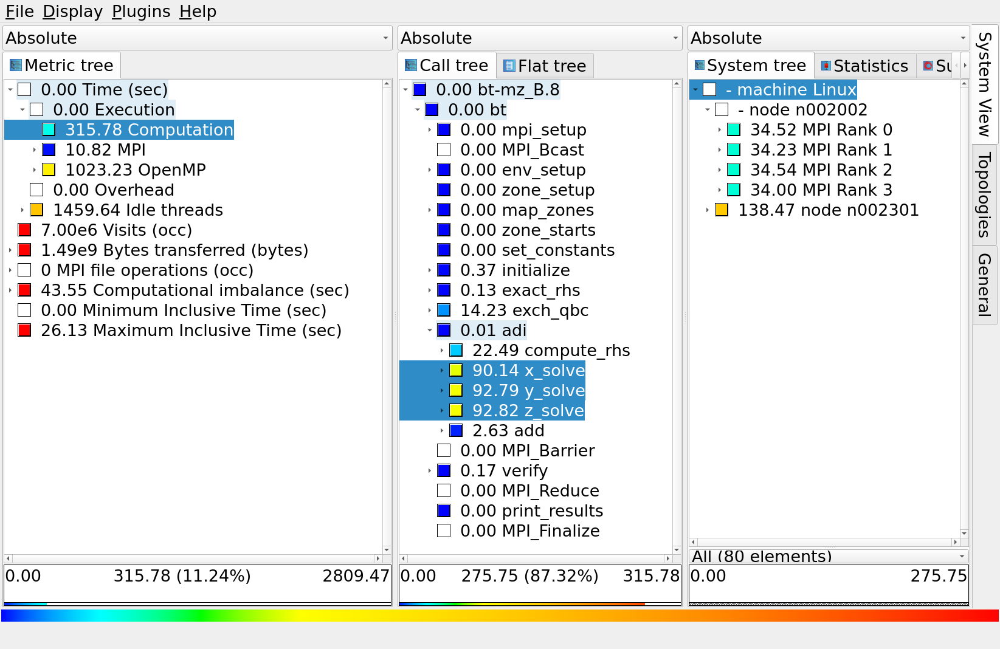

# Explore profile with CUBE

Congratulations, now we collected our first measurements with acceptable runtime dilation. This new measurement should accurately represent the real runtime behavior of the BT-MZ application, and can now be postprocessed and interactively explored using the Cube browser. These two steps can be conveniently initiated using the following command:
```bash
$ # Load modules if not loaded already
$ module load gcc/10.2.0 openmpi/4.0.5-gcc10.2.0
$ module use /jet/home/zhukov/ihpcss24/modules/
$ module load scorep/8.4-gcc_openmpi scalasca/2.6-gcc_openmpi
$ # execute postprocessing
$ square scorep_bt-mz_C_8x6_sum_filt
```

This command will post-process a `profile.cubex` and create a summary report `summary.cubex`, then open the CUBE browser.

:::info

Exploring profiles via the CUBE over SSH can be very slow due to the high data transfer rates and latency involved. To improve performance, it is recommended to copy the profile data to a local machine where CUBE is installed. By examining the profile locally, you can benefit from faster data access and more responsive analysis, leading to a more efficient and effective performance tuning process.

:::

Cube is a generic user interface for presenting and browsing performance and debugging information from parallel applications. The Cube main window consists of three coupled panels containing tree displays or alternate graphical views of analysis reports. The left panel shows *performance properties* of the execution, such as time or the number of visits. The middle pane shows the *call tree* or a flat profile of the application. The right pane either shows the *system hierarchy* consisting of, e.g., machines, compute nodes, processes, and threads, a topological view of the application's processes and threads (if available), or a *box plot* view showing the statistical distribution of values across the system. All tree nodes are labeled with a metric value and a color-coded box which can help in identifying hotspots. The metric value color is determined from the proportion of the total (root) value or some other specified reference value, using the color scale at the bottom of the window.

A click on a performance property or a call path selects the corresponding node. This has the effect that the metric value held by this node (such as execution time) will be further broken down into its constituents in the panels right of the selected node. For example, after selecting a performance property, the middle panel shows its distribution across the call tree. After selecting a call path (i.e., a node in the call tree), the system tree shows the distribution of the performance property in that call path across the system locations. A click on the icon to the left of a node in each tree expands or collapses that node. By expanding or collapsing nodes in each of the three trees, the analysis results can be viewed on different levels of granularity (inclusive vs. exclusive values).



For example, in the figure we can see the distribution of the "Computation time" of the following three functions `x_solve`, `y_solve`, `z_solve` over 14 MPI ranks on node one and accumulated time across all MPI ranks on node two .

All tree displays support a context menu, which is accessible using the right mouse button and provides further options. For example, to obtain the exact definition of a performance property, select "Online Description" in the context menu associated with each performance property. A brief description can also be obtained from the menu option "Info".

:::info

To make effective use of the GUI please also consult the [Cube User Guide](https://apps.fz-juelich.de/scalasca/releases/cube/4.8/docs/guide/html/) or visit the CUBE [YouTube](https://www.youtube.com/@scalascacube3343/videos) channel.

:::

:::tip[Question]

Examine our BT-MZ measurements in the CUBE browser and try to answer the following questions
* What percentage of the total time is spent on computation, MPI, OpenMP? 
* What is the name of the routine with the largest execution time (inclusive)?
* What is the name of the routine with the largest execution time (exclusive)? 
* How many times has the `adi` routine been called?
* Which routines are the biggest contributors to the runtime?
* What is the min and max execution time of the `compute_rhs` routine across all threads (all MPI processes)? 
  
:::
 