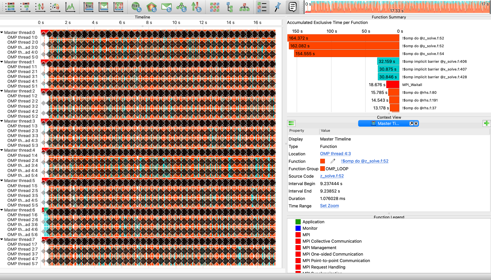

# Explore traces with Vampir

Vampir is a performance analysis tool used to visualize and analyze the execution of parallel programs. Now we are going to visualise and explore collected traced of BT_MZ application.

:::warning

*Vampir is not available on the Bridges-2!*

Make sure you have Vampir installed on your local laptop. You can download demo version from the official [Vampir website](https://vampir.eu/downloads/demo).

:::

You can copy prepared traces from [here](https://fz-juelich.sciebo.de/s/qBq6OrhJImHulbr) or from Bridges-2 via the following command executed on you local machine  
```bash
$ # go to the directory were you want to store measurements
$ cd <my_directory>
$ # copy files from Bridges-2 to your current directory 
$ scp userid@bridges2.psc.edu:/jet/home/zhukov/ihpcss24/tutorial/measurements_bridges2.tar.gz .
$ # untar experiments
$ tar xvf measurements_bridges2.tar.gz
```

Go to the directory where experiments are stored 
```bash
$ cd measurements_bridges2/bin.scorep/
```

Open collected traces with Vampir
```bash
$ vampir scorep_bt-mz_C_8x6_trace/traces.otf2
```
When the trace file is loaded, you will see Vampir's main interface, which is divided into several panes that provide different views of the trace data. The key panes include the Timeline View, Function Summary, Context View, and Functional Legend. 



The Timeline View displays a detailed timeline of events, the Function Summary lists functions and their execution metrics, Context View provides detailed information of a selected object additional to its graphical representation, and the Function Legend lists all visible function groups of the loaded trace file along with their corresponding color.

To analyze the Timeline View, you can zoom in by clicking and dragging along the timeline. Tooltips are available by hovering over events, providing detailed information about them. Filters are also available to focus on specific functions, processes, or time ranges.

Next, you can use the Summary Timeline, accessible from the Charts menu. It depicts the fractions of the number of pro- cesses that are actively involved in given activities at a certain point in time. This chart is useful for studying communication overhead and load imbalance issues from a high level perspective.

The Communication Matrix View accessible from the Charts shows information about messages sent between processes. It allows to analyze communication imbalances.

:::tip[Tips for Effective Analysis]

For effective analysis, start with a high-level overview and gradually drill down into specific areas of interest. Use multiple views in conjunction to get a comprehensive understanding of performance issues. Additionally, utilize Vampir’s annotation features to mark important events and observations.

:::

After conducting your analysis, you can save your current analysis state by going to File and selecting Save Preferences. This feature allows you to revisit your analysis without needing to reconfigure views and filters.